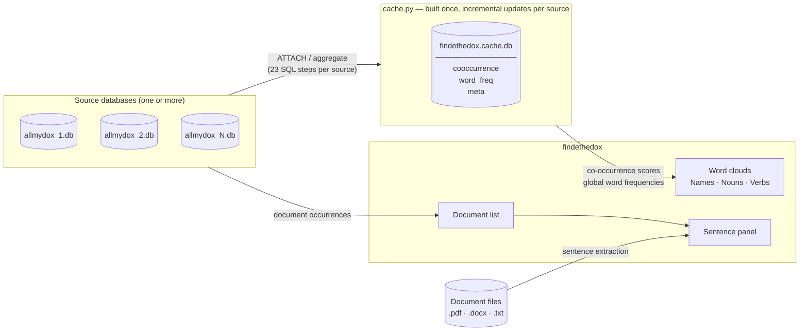

# findethedox

Visual exploration tool for document collections indexed by
[allmydox](https://github.com/cndrbrbr/allmydox). Displays three interactive
word clouds — Names, Nouns, Verbs — and lets you navigate from any word
directly to the documents and sentences where it appears.

Runs on **Linux** and **Windows**.

---

## Requirements

- Python 3.9 or newer
- One or more `allmydox.db` databases produced by [allmydox](https://github.com/cndrbrbr/allmydox)

---

## Setup

**Linux**

```bash
cd findethedox
bash setup.sh
```

**Windows**

```bat
cd findethedox
setup.bat
```

Both scripts install PyQt6, wordcloud, pymupdf, and matplotlib.

---

## Starting the application

```bash
python3 main.py
```

If no database path is given and `allmydox.db` is not found in the current
directory, a file dialog opens so you can browse to the database.

You can also pass one or more database paths directly:

```bash
python3 main.py /path/to/allmydox.db
python3 main.py /path/to/first.db /path/to/second.db
```

If the documents have been moved or the database was created on a different
machine, pass the folder where the files now live:

```bash
python3 main.py /path/to/allmydox.db --docs /path/to/documents
```

On the first launch the application builds a search cache. This takes a
few minutes depending on database size and only happens once — subsequent
launches are instant.

---

## Interface overview




```
┌─────────────────────────────────────────────────────────┬──────────────────┐
│  Search: [ type a word and press Enter ______________ ] │                  │
│                                                         │  Documents       │
│  ┌──────────────┐ ┌──────────────┐ ┌────────────────┐  │  (right-click    │
│  │    Names     │ │    Nouns     │ │     Verbs      │  │   or Enter)      │
│  │              │ │              │ │                │  │                  │
│  │  word cloud  │ │  word cloud  │ │  word cloud    │  │  ┌────────────┐  │
│  │              │ │              │ │                │  │  │ Sentences  │  │
│  └──────────────┘ └──────────────┘ └────────────────┘  │  │ (click doc)│  │
└─────────────────────────────────────────────────────────┴──────────────────┘
```

---

## Using the word clouds

### On startup — global view

When no search term has been entered, all three clouds show the most frequent
words across the entire document collection. Larger words appear more often in
the documents.

### Searching for a word

Type a word in the search bar and press **Enter**. The three clouds update to
show all nouns, names, and verbs that co-occur with your word in sentences or
paragraphs. Word size reflects the co-occurrence score:

> **score = sentence co-occurrences × 1.3 + paragraph co-occurrences**

Sentence co-occurrences are weighted 30 % higher because a shared sentence
is a stronger signal than a shared paragraph. If the word exists in more than
one category, results from all categories are combined.

### Left-click — follow a word

Left-clicking any word in any cloud makes that word the new search term. All
three clouds immediately recentre around the clicked word. This lets you
navigate through the vocabulary by following associations.

### Right-click — document list without changing the clouds

Right-clicking a word updates the document panel for that word without changing
the current cloud view. Useful for checking where a word appears while keeping
the co-occurrence picture visible.

---

## Document panel

The **document panel** on the right side of the window shows every document and
page where the current word appears, one entry per (document, page) pair.
Results from all loaded databases are merged and deduplicated.

The panel updates whenever the active word changes:

- **Enter** after typing → panel updates for the typed word
- **Left-click** on a cloud word → clouds recentre and panel updates
- **Right-click** on a cloud word → panel updates without changing the clouds

### Single-click — sentence preview

Single-clicking any document in the list opens a **sentence panel** alongside
it, showing all sentences from that document that contain the search word.
Works for PDF, DOCX, and TXT files.

### Double-click — open document viewer

Double-clicking opens the built-in document viewer at the relevant page.

---

## Document viewer

### PDF files

The PDF is rendered page by page. The viewer opens at the first page
containing the word; all occurrences of the word on the visible page are
**highlighted in yellow**.

Use the **◀ Prev** and **Next ▶** buttons to move between pages.

### DOCX and TXT files

The file content is shown as plain text. The cursor is placed at the first
occurrence of the word and scrolled into view.

---

## Menus and toolbar

### File menu

| Item | Shortcut | Description |
|---|---|---|
| Open Database… | Ctrl+O | Pick a different `.db` file and open it in a new window |
| Databases & Cache… | Ctrl+Shift+O | Manage databases and cache (see below) |

### Settings menu

| Item | Description |
|---|---|
| Set Documents Folder… | Override the folder used to locate document files |

**Set Documents Folder** is useful when the database was created on a different
machine or the document files have been moved. The application first tries the
path stored in the database; if the file is not found there it looks for the
filename inside the documents folder you specify.

### Toolbar

| Button | Description |
|---|---|
| Rebuild Cache | Deletes the current cache and rebuilds it from scratch (confirmation required) |

---

## Databases & Cache dialog

Open via **File > Databases & Cache…** or press **Ctrl+Shift+O**.

This dialog is the central place to configure which databases are loaded and
where the cache is stored.

### Cache folder

Select the folder where `findethedox.cache.db` will be stored. The full path
is shown below the field. One cache covers all databases in the current session.

### Database list

Each database appears in the list with a status indicator:

| Icon | Colour | Meaning |
|---|---|---|
| ✓ | Green | In the cache and up to date |
| ⚠ | Yellow | In the cache, but new documents have been added to the source since the last build |
| ✗ | Red | Not yet included in the cache |
| — | Grey | Cache file does not exist yet |

Use **Add Database…** to append a source database to the list. Select one or
more entries and click **Remove Selected** to remove them.

### Building and updating the cache

The **Build Cache** / **Update Cache** button processes any databases that are
missing or outdated:

- If no cache exists, a full build runs from scratch.
- If a cache exists, only the databases marked ✗ or ⚠ are processed
  (incremental update). Existing cache data for up-to-date sources is preserved.

A progress dialog shows each step. The status icons refresh automatically when
the operation completes.

### Applying changes

Click **Apply** to save the configuration and reopen the main window with the
new database set. Click **Cancel** to discard any changes.

---

## Multiple databases

findethedox can search across several allmydox databases simultaneously. All
co-occurrence scores and word frequencies are combined in a single cache.
When you search for a word, documents from all sources are listed together
and duplicates are removed.

To use multiple databases, open **Databases & Cache…** and add as many
`.db` files as you need, then build or update the cache.

---

## Notes

- The source databases are opened **read-only** during normal operation. The
  only write to a source database is the one-time index creation on first launch.
- If you add new documents to a source database using allmydox, open
  **Databases & Cache…** and click **Update Cache** to pick them up.
- All settings are saved automatically to
  `~/.config/findethedox/config.json` and restored on the next launch.
