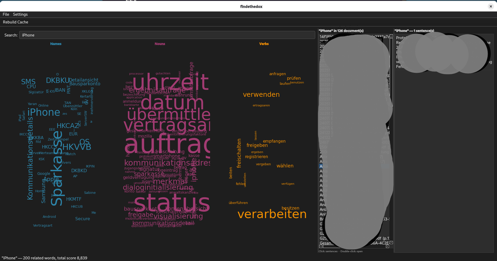

# findethedox

Visual exploration tool for document collections indexed by
[allmydox](https://github.com/cndrbrbr/allmydox). Displays three
interactive word clouds — Names, Nouns, Verbs — and lets you navigate
from any word directly to the documents and pages where it appears.

Runs on **Linux** and **Windows**.

---

## Requirements

- Python 3.9 or newer
- An `allmydox.db` database produced by [allmydox](https://github.com/cndrbrbr/allmydox)

---

## Setup

**Linux**

```bash
cd findethedox
bash setup.sh
```

**Windows**

```bat
cd findethedox
setup.bat
```

Both scripts install PyQt6, wordcloud, pymupdf, and matplotlib.

---

## Starting the application

```bash
python3 main.py
```

If no database path is given and `allmydox.db` is not found in the current
directory, a file dialog opens so you can browse to the database.

You can also pass the database path directly:

```bash
python3 main.py /path/to/allmydox.db
```

If the documents have been moved or the database was created on a different
machine, pass the folder where the files now live:

```bash
python3 main.py /path/to/allmydox.db --docs /path/to/documents
```

On the first launch the application builds search indexes on the database
in the background. This takes a minute or two depending on database size
and only happens once — subsequent launches are instant.

---

## Interface overview



```
┌─────────────────────────────────────────────────────────┬──────────────┐
│  Search: [ type a word and press Enter ______________ ] │              │
│                                                         │  Documents   │
│  ┌──────────────┐ ┌──────────────┐ ┌────────────────┐  │  (appears    │
│  │    Names     │ │    Nouns     │ │     Verbs      │  │  on right-   │
│  │              │ │              │ │                │  │  click)      │
│  │  word cloud  │ │  word cloud  │ │  word cloud    │  │              │
│  │              │ │              │ │                │  │              │
│  └──────────────┘ └──────────────┘ └────────────────┘  │              │
└─────────────────────────────────────────────────────────┴──────────────┘
```

---

## Using the word clouds

### On startup — global view

When no search term has been entered all three clouds show the most
frequent words across the entire document collection. Larger words appear
more often in the documents.

### Searching for a word

Type a word in the search bar and press **Enter**. The three clouds update
to show all nouns, names, and verbs that co-occur with your word in
sentences or paragraphs. Word size reflects the co-occurrence score:

> **score = sentence co-occurrences × 1.3 + paragraph co-occurrences**

Sentence co-occurrences are weighted 30 % higher because a shared sentence
is a stronger signal than a shared paragraph.

The search matches nouns, names, and verbs — if the word exists in more
than one category, results from all categories are combined.

### Left-click — follow a word

Left-clicking any word in any cloud makes that word the new search term.
The clouds immediately re-centre around the clicked word. This lets you
navigate through the vocabulary by following associations.

### Document panel — automatic updates

The **document panel** on the right side of the window updates automatically
whenever the active word changes:

- **Enter** after typing a word → panel shows documents for that word
- **Left-click** on a word → clouds re-centre and panel updates for the new word
- **Right-click** on a word → panel updates for that word without changing the clouds

The panel lists every document and page where the word occurs, one entry per
page. The format is:

```
filename.pdf  (p.12)
filename.pdf  (p.47)
other_doc.docx  (p.1)
```

### Opening a document

**Double-click** any entry in the document list to open the built-in
viewer at the relevant page.

---

## Document viewer

### PDF files

The PDF is rendered page by page. The viewer opens directly at the first
page containing the word, and all occurrences of the word on the visible
page are **highlighted in yellow**.

Use the **◀ Prev** and **Next ▶** buttons to move between pages.

### DOCX and TXT files

The file content is shown as plain text. The cursor is placed at the first
occurrence of the word and scrolled into view. Use **Ctrl + F** (or your
operating system's find function) to locate further occurrences.

---

## File menu

| Item | Shortcut | Description |
|---|---|---|
| Open Database… | Ctrl+O | Pick a different `.db` file; opens a new window |
| Set Documents Folder… | — | Override the folder used to locate document files |

**Set Documents Folder** is useful when the database was created on a
different machine or the document files have been moved. When set, the
application first tries the path stored in the database; if the file is
not found there it looks for the filename inside the documents folder you
specified.

---

## Notes

- The database file is opened **read-only** during normal operation. The
  only write operation is the one-time index creation on first launch.
- If you add new documents to the database using allmydox, simply re-run
  `python3 main.py` — the new content will appear automatically.
- The document panel stays visible until you start a new search. Close it
  by searching for a different word or clicking elsewhere in the window.
