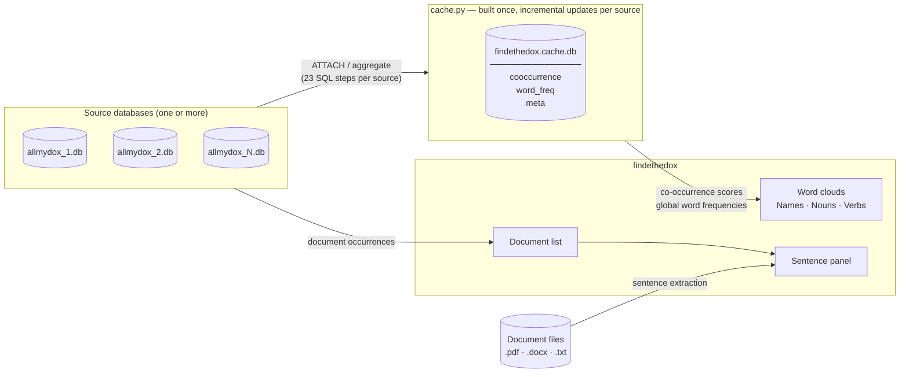

# Architecture

## Overview

findethedox has three conceptual layers:

1. **Source databases** — one or more `allmydox.db` SQLite files that contain
   the indexed document vocabulary and co-occurrence tables.
2. **Cache** — a single pre-computed `findethedox.cache.db` that aggregates
   all co-occurrence scores across all sources so every search takes 2–5 ms.
3. **UI** — a PyQt6 main window with three interactive word clouds, a document
   panel, a sentence panel, and a built-in document viewer.



---

## Modules

| File | Responsibility |
|---|---|
| `main.py` | Entry point: CLI arguments, config loading, creates `MainWindow` |
| `app.py` | `MainWindow`, `SetupDialog`, four `QThread` worker classes |
| `cloud_widget.py` | Interactive word cloud widget (wordcloud layout + matplotlib hit-testing) |
| `query.py` | Queries against source databases: frequencies, co-occurrences, document occurrences, index creation |
| `cache.py` | Pre-computed cache: `build`, `update`, `needs_update`, read accessors |
| `config.py` | Persistent settings in `~/.config/findethedox/config.json` |
| `doc_viewer.py` | Built-in viewer for PDF (pymupdf + highlight), DOCX, TXT; sentence extraction |

---

## Source databases

Each source database is an SQLite file produced by allmydox. The tables
relevant to findethedox:

| Table | Content |
|---|---|
| `documents` | One row per indexed document; `fileID` is the primary key |
| `nouns` / `noun_occurrences` | Vocabulary and per-document noun occurrence positions |
| `names` / `name_occurrences` | Same for proper names |
| `verbs` / `verb_occurrences` | Same for verbs |
| `noun_sentence` | Pairs of nouns/names that appear in the same sentence |
| `noun_paragraph` | Same within the same paragraph |
| `noun_verb_sentence` | Noun/name–verb pairs within the same sentence |

On first launch, `query.ensure_indexes()` adds 9 indexes to these tables.
Without them, co-occurrence queries would require full table scans (30+ s on
a 5 GB database).

---

## Cache

### Why a cache?

A single search requires aggregating co-occurrence counts across tens of
millions of rows in `noun_sentence` and `noun_paragraph`. Even with source-DB
indexes, each query takes 90–120 s on a 5 GB database. The cache pre-computes
all co-occurrence scores once, reducing every search to a single indexed
SELECT.

### Tables

| Table | Schema | Purpose |
|---|---|---|
| `cooccurrence` | `(src_word, src_kind, tgt_word, tgt_kind, score)` | All pre-aggregated scores |
| `word_freq` | `(word, kind, freq)` UNIQUE on `(word, kind)` | Total occurrence counts for the global cloud |
| `meta` | `(key, value)` | Per-source watermarks: `src:/path/to/db → last_fileID` |

Indexes on the cache:
- `idx_cooc` on `lower(src_word)` — used by every word search
- `idx_wf_uk` UNIQUE on `(word, kind)` — enforces the upsert constraint
- `idx_wf` on `(kind, freq DESC)` — used by the global cloud query

### Build process (`cache.build`)

Each source database is processed in sequence using SQLite's `ATTACH DATABASE`
so no data leaves SQLite. 23 `INSERT … SELECT` steps run per source:

| Count | Source table | Weight | What is captured |
|---|---|---|---|
| 8 | `noun_sentence` | ×1.3 | noun↔noun, noun↔name, name↔noun, name↔name — forward and reverse |
| 8 | `noun_paragraph` | ×1.0 | same four combinations — forward and reverse |
| 4 | `noun_verb_sentence` | ×1.3 | noun↔verb, name↔verb — both directions |
| 3 | occurrence tables | — | word frequency counts (noun, name, verb) |

After all sources are processed, staging tables (`raw`, `freq_raw`) are
consolidated into the permanent tables with a `GROUP BY … SUM(score)` pass,
indexes are created, and staging tables are dropped. Watermarks for each source
are written to `meta`.

### Incremental updates (`cache.update`)

For each source, the update reads its watermark from `meta`:

```
last = meta["src:/path/to/db"]  →  0 if not present (new source)
cur  = MAX(fileID) FROM documents in that source
if cur > last:
    run 23 steps with WHERE fileID > last   →  raw_delta / freq_delta
    merge delta into cooccurrence (INSERT)
    merge delta into word_freq   (INSERT … ON CONFLICT DO UPDATE SET freq = freq + excluded.freq)
    write new watermark to meta
```

A brand-new source database (no watermark) is treated as `last = 0`, so all
its documents are processed as "new" and its data is merged into the existing
cache without a full rebuild.

### Cache file location

The cache file is always named `findethedox.cache.db`. The user picks a folder
in the **Databases & Cache** dialog; the derived path is saved to config. Each
independent database set (different combination of sources) should use its own
folder to avoid mixing unrelated data.

### One cache, multiple sources

There is exactly **one** cache file per session. It contains the combined
co-occurrence data from all source databases. The `meta` table's per-source
watermarks allow the update process to add or refresh individual sources
without disturbing the rest of the cache.

---

## Worker threads

All slow operations run in `QThread` subclasses. Each worker opens its own
SQLite connections (connections cannot be shared across threads).

| Worker | When started | Signals emitted |
|---|---|---|
| `_IndexWorker` | App startup | `done` |
| `_CacheWorker` | First launch / Rebuild button / Setup dialog | `progress(label, cur, total)`, `done`, `error(msg)` |
| `_SearchWorker` | Search bar Enter / cloud click | `cooc_ready(rows, word)`, `docs_ready(occs, word)`, `not_found(word)`, `error(msg)` |
| `_SentenceWorker` | Single-click on document | `ready(sentences)`, `error(msg)` |

---

## Startup sequence

```
main.py
  └─ load config, resolve db_paths / cache_path
  └─ MainWindow(db_paths, cache_path)

MainWindow.__init__
  └─ _IndexWorker  ──────────────────────── ensure 9 source-DB indexes exist
        └─ done → _on_indexes_ready()
              ├─ cache exists? → connect, load_global() → show clouds
              └─ no cache     → _CacheWorker(mode="build")
                                      └─ done → connect, load_global() → show clouds

Toolbar "Rebuild Cache"
  └─ _CacheWorker(mode="build")  ─────── full rebuild from scratch
```

---

## Query flow

### Global cloud (startup / empty search box)
```sql
SELECT word, kind, freq FROM word_freq
ORDER BY freq DESC LIMIT 450
```
Result is split by `kind` and handed to the three `CloudWidget` instances.

### Word search
```
_SearchWorker:
  1. SELECT tgt_word, tgt_kind, SUM(score) AS score
     FROM cooccurrence
     WHERE lower(src_word) = ?
     GROUP BY tgt_word, tgt_kind
     ORDER BY score DESC LIMIT 200
     → cooc_ready → update clouds

  2. for each source db:
       query.document_occurrences(conn, word)
     merge + deduplicate across sources
     → docs_ready → populate document list
```

### Sentence extraction
```
_SentenceWorker:
  doc_viewer.sentences_containing(filepath, word)
  → extract full text (PDF page-by-page, DOCX XML, TXT)
  → split into sentences
  → filter to sentences containing the word
  → ready → populate sentence list
```

---

## Configuration file

`~/.config/findethedox/config.json`:

```json
{
  "db_paths":     ["/path/to/first.db", "/path/to/second.db"],
  "cache_path":   "/path/to/cache/findethedox.cache.db",
  "cache_folder": "/path/to/cache",
  "docs_folder":  "/path/to/documents"
}
```

`cache_path` is derived as `cache_folder + "/findethedox.cache.db"` and stored
redundantly so that code that reads only `cache_path` (e.g. the startup path
resolver in `main.py`) continues to work without knowledge of the folder
convention.
